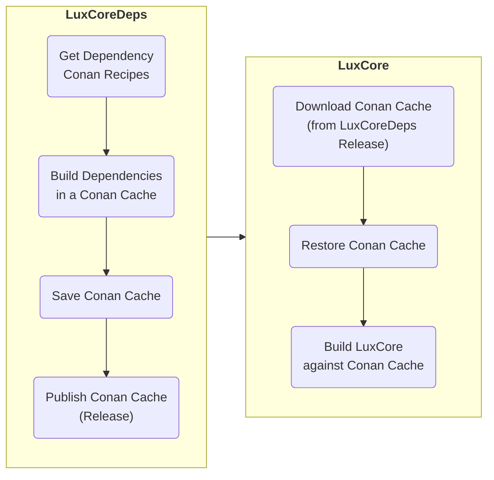

# LuxCoreDeps - The LuxCore Dependency Provider

## About

**LuxCoreDeps provides the dependencies required to build LuxCore, starting with
version 2.10.**

LuxCoreDeps is based on Conan dependency manager (https://conan.io/). It builds dependency
sets for the following 4 platforms:
- Linux
- Windows
- MacOS x86_64
- MacOS ARM64

## How does it work?

### On provider side (LuxCoreDeps)
LuxCoreDeps populates a Conan cache, by building & installing all the
dependencies required to build LuxCore.
Dependencies encompass binaries, headers, build profiles, metadata...

Once populated, the cache is bundled (`conan cache save`) and published
in a Github release.

### On consumer side (LuxCore)
In LuxCore, the provided cache is downloaded from the release and
restored locally (`conan cache restore`), thus making all the dependencies
available for LuxCore build.
In LuxCore, cache download and restoration are wrapped in a convenient
`make deps` statement.

## Building & Publishing LuxCore Dependencies

_(For admin only - requires appropriate rights on repository)_

Dependencies are built from sources, thanks to Conan recipes. Building from
sources provides the following benefits:
- The binary compatibility (compiler version, GLIBC version etc.) can be controlled
  in a fine-grained manner. Which, in particular, is required for Python wheel.
- The options of each dependency can be selected precisely.
- The build options (SSE, AVX, compiler optimizations...) can also be selected
  in fine detail.
- Dependency source code can be patched if needed.

LuxCoreDeps is exclusively intended to be run in continuous integration by
Github Actions.

To trigger dependency build & publish, use **LuxCore Dependency Releaser** action,
with `Run workflow` button:
https://github.com/LuxCoreRender/LuxCoreDeps/actions/workflows/release.yml. This
action will build the dependency package and publish it in a release. Please follow
semantic versioning when doing so.

Once built, dependencies are made available to LuxCore via LuxCoreDeps
**releases**: https://github.com/LuxCoreRender/LuxCoreDeps/releases

Note that, for debugging purpose, dependency build is also triggered by
`push` events; however, in that case, no release is created.

## Adding or Upgrading Dependencies in LuxCoreDeps

_(For admin only - requires appropriate rights on repository)_

Dependencies can be added or upgraded in LuxCoreDeps by upgrading the `conanfile.py`
file, located in the repository root.

Please refer to Conan documentation for syntax of `conanfile.py` and instructions
how to modify such a file.

## Tips & Caveats

### Where to start - LuxCoreDeps entry points
The main entry point is `.github/workflows/build.yml`.
Other interesting files may be:
- `conanfile.py`: Conan script to build dependencies
- `conan-profiles`: folder with Conan profiles

### Versioning rules
LuxCoreDeps follows Semantic Versioning (https://semver.org).

### Compilation environment
For Python wheels to be built properly, it is essential that dependencies be built
by `CIBUILDWHEEL`, with the same environment (compiler version, manylinux container,
etc.) as the one intended for the wheels.
Our implementation to fulfill this requirement consists in building a fake wheel in LuxCoreDeps.

### Local recipes
Most of Conan recipes used by LuxCoreDeps are to be found in Conan central repository (Conan center).
However, a few ones did not exist on-the-shelf and were created as local recipes: see `local-conan-recipes` folder.

### Debugging
Dependency build can be debugged locally using `nektos/act`
(https://github.com/nektos/act).

`utils/debug.sh` contains a working example of `act`invokation under Linux.

## License
This code is released under Apache 2.0 license.
