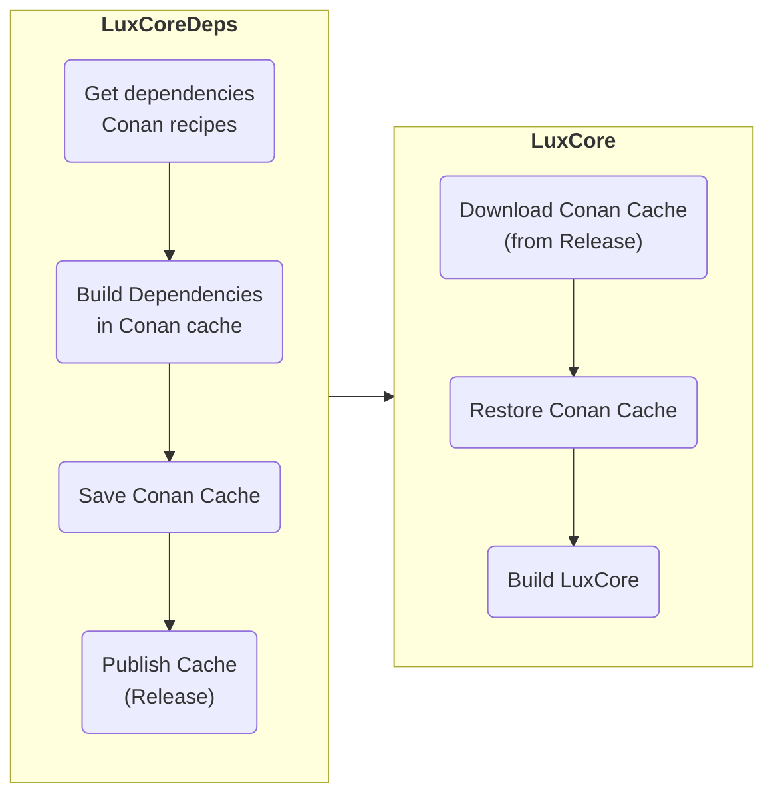

# LuxCoreDeps - The LuxCore Dependency Provider

## About

**LuxCoreDeps provides the dependencies required to build LuxCore, starting with
version 2.10.**

LuxCoreDeps is based on Conan dependency manager (https://conan.io/) and Github
Actions (https://github.com/features/actions). It builds dependency sets for
the following 4 platforms:
- Linux
- Windows
- MacOS x86_64
- MacOS ARM64

## How does it work?

LuxCoreDeps populates a Conan cache, by building & installing all the
dependencies (binaries, headers, profiles, metadata...) required to build
LuxCore.
Once populated, the cache is bundled (`conan cache save`) and published
in a Github release.

On consumer side (LuxCore), the cache is downloaded from the release and
restored locally (`conan cache restore`), thus making all the dependencies
available for LuxCore build.
Cache download and restoration are wrapped in `make deps` statement.

## Building & Publishing LuxCore Dependencies

_(For admin only - requires appropriate rights on repository)_

Dependencies are built from sources, thanks to Conan recipes. Building from
sources provides the following benefits:
- The binary compatibility (compiler version, GLIBC version etc.) can be controlled
  in a fine-grained manner. Which, in particular, is required for Python wheel.
- The options of each dependency can be selected precisely.
- The build options (SSE, AVX, compiler optimizations...) can also be selected
  in fine detail.
- Dependency source code can be patched if needed.

LuxCoreDeps is exclusively intended to be run in continuous integration by
Github Actions. The main execution script is `.github/workflows/deps.yml`.

Once built, dependencies are made available to LuxCore via LuxCoreDeps
**releases**: https://github.com/LuxCoreRender/LuxCoreDeps/releases

To trigger dependency build & publish, use `workflow_dispatch` event:
https://github.com/LuxCoreRender/LuxCoreDeps/actions/workflows/deps.yml. This
action will build the dependency package and publish it in a release.

Please note that, for debugging purpose, dependency build is also triggered by
`push` events; however, in that case, no release is created.

## Adding Dependencies to LuxCore

_(For admin only - requires appropriate rights on repository)_

Dependencies can be added in `conanfile.py` file, in the repository root.

Please refer to the Conan documentation for instructions.

## Caveats & Tips

### LuxCoreDeps Entry points
The main entry point is `.github/workflows/deps.yml`.
Other interesting files may be:
- `conanfile.py`: Conan script to build dependencies
- `conan-profiles`: folder with Conan profiles

### Compilation environment
For Python wheels to work properly, it is essential that dependencies be built
by `CIBUILDWHEEL`, with the same environment (compiler version, docker image,
etc.) as the one intended for the wheels.
Note that it requires to build a fake wheel.

### Debugging
Dependency build can be debugged locally using `nektos/act`
(https://github.com/nektos/act).

In LuxCoreDeps repository, `debug.sh` contains a working example of `act`
invokation under Linux.

## License
This code is released under Apache 2.0 license.
